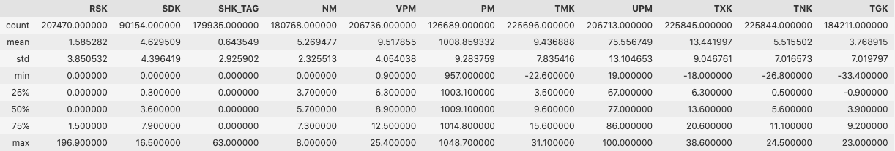
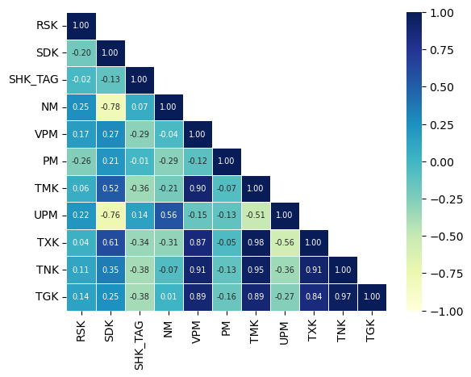
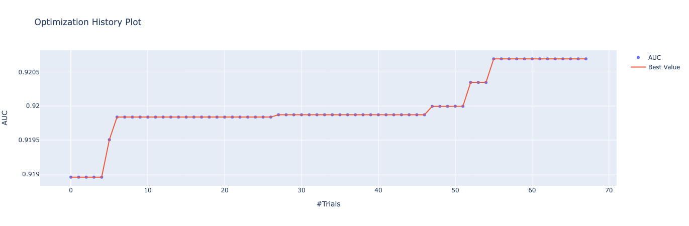
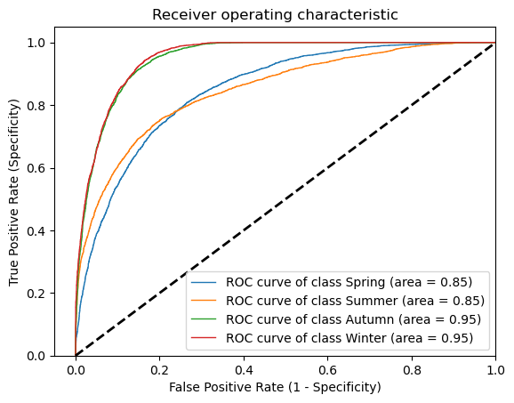
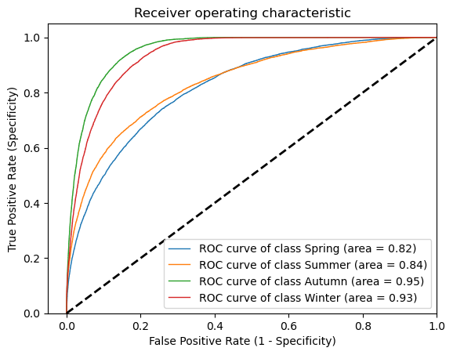
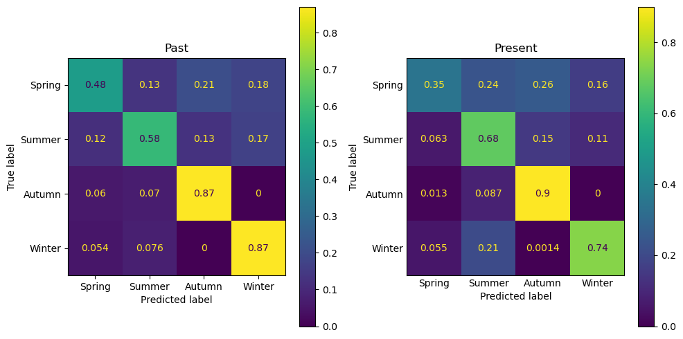
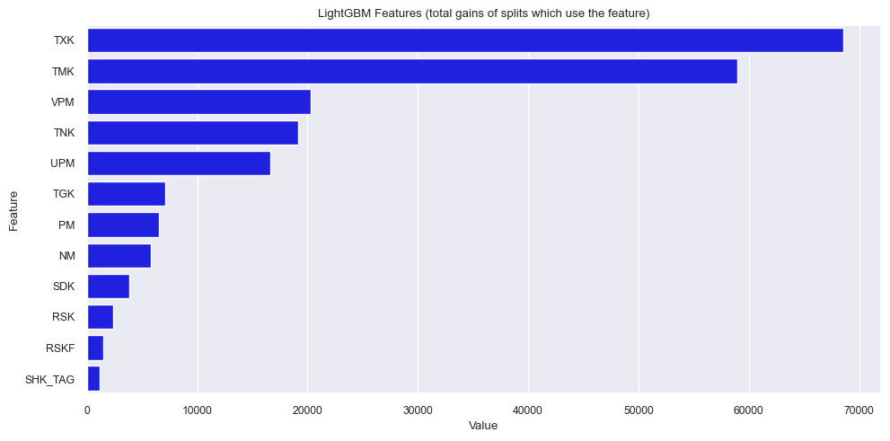
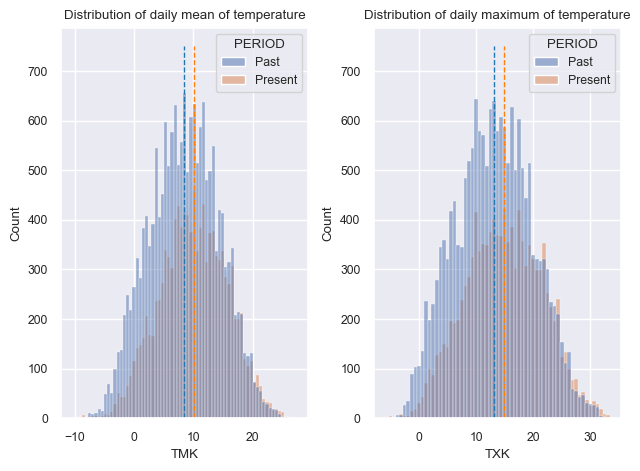

# Udacity Data Scientist Capstone Project
## Project Definition
### Project Overview
When talking to older people, they often say that in their youth seasons were different. A summer was a "real" summer, a winter was a "real" winter.


In this project I'd like to investigate:
* Is a machine learning algorithm capable of predicting the season if it is given the weather conditions of a day?
* Can it be shown that seasons in the past were different?

[DWD](https://www.dwd.de/EN/Home/home_node.html)'s dataset "DWD Climate Data Center (CDC): Historical daily station observations (temperature, pressure, precipitation, sunshine duration, etc.) for Germany, version v21.3, 2021" will be used to answer those questions. Observations from the Berlin (Germany) area will be used. 

### Problem Statement
#### Machine Learning
In the machine learning part, the task is to find a classifier that is able to predict seasons.
* How good is a classifier at predicting the season (spring, summer, autumn, winter) an observation has been made in?
* Does the quality of the predictions differ when comparing the classifications of observations from the past to current ones?

#### Statistics
In the statistics part, these hypotheses are to be tested. TMK is the daily mean of temperature. TXK is the daily maximum of temperature at 2m height.
* TMK
   * $H_{0-TMK}$: The mean of the winter TMK distribution in the interval 1940 - 1970 is the same as in the interval 2000 - today.  
   * $H_{a-TMK}$: The mean of the winter TMK distribution in the interval 1940 - 1970 is different from the one in the interval 2000 - today.
* TXK
   * $H_{0-TXK}$: The mean of the winter TMX distribution in the interval 1940 - 1970 is the same as in the interval 2000 - today.  
   * $H_{a-TXK}$: The mean of the winter TMX distribution in the interval 1940 - 1970 is different from the one in the interval 2000 - today.


In addition to comparing the means of the two samples (past & present), it will be tested whether there is a trend in the observations of the coldest days in winter. 
* $H_0$: There is no trend in the "It was at least that cold in December" values.  
* $H_a$: There is some trend in the "It was at least that cold in December" values.

### Metrics
In his blog post [Which evaluation metric shoud you choose](https://neptune.ai/blog/f1-score-accuracy-roc-auc-pr-auc) Jakub Czakon presents a nice overview of popular metrics like F1-Score, PR AUC, Accuracy and ROC AUC. As we want to solve a multiclass classification problem, we need a metric that is appropriate for that purpose and available in the implementation of the classifier. LightGBM, which is the classifier that will be used, has a metric *auc_mu* for multiclass classification problems. 
$AUC_μ$: [A Performance Metric for Multi-Class Machine Learning Models](https://proceedings.mlr.press/v97/kleiman19a/kleiman19a.pdf)
>The area under the receiver operating characteristic curve (AUC) is arguably the most common metric in machine learning for assessing the quality of a two-class classification model. As the number and complexity of machine learning applications grows, so too does the need for measures that can gracefully extend to classification models trained for more than two classes. Prior work in this area has proven computationally intractable and/or inconsistent with known properties of AUC, and thus there is still a need for an improved multi-class efficacy metric. We provide in this work a multi-class extension of AUC that we call $AUC_μ$ that is derived from first principles of the binary class AUC. $AUC_μ$ has similar computational complexity to AUC and maintains the properties of AUC critical to its interpretation and use. 


## Analysis
### Data Exploration
#### Descriptive Statistics


The table provides the basic statistics for the numeric features. We see that the mean temperature in the Berlin area is 9.4°C. The lowest temperature measured has been -33.4°C. The SHK_TAG maximum value stands out. 63 cm of snow are quite unusual for the Berlin area. 
`clean.query('SHK_TAG == SHK_TAG.max()')` will give us the date this extreme snow depth was measured on. It is 1979-02-18. The winter 1978/1979 was indeed a really [harsh winter in Germany](https://www.vintag.es/2021/01/1978-germany-blizzard.html).

>This blizzard was just the beginning of the winter that crippled everything in Germany, for another round of snow and ice of similar proportions fell later on February 18/19, 1979.

#### Correlation Matrix
The correlation matrix shows how features are related.




We see some quite obvious correlations:
* There is a positive high correlation between min, max and average temparatures.
* There is a negative correlation sunshine duration (SDK), mean cloud cover (NM) and mean relative humidity (UPM).
### Data Visualization
A pairplot of the data might give a how good the chances are to train a classifier to predict seasons.


In many cases the seasons are separated quite clearly. Therefore a classifier should be able to predict a season. 
## Methodology
### Data Preprocessing
The DWD dataset contains these attributes.
| Column | Meaning | Unit |
| --- | --- | --- |
| STATIONS_ID | station id ||
| MESS_DATUM | date | yyyymmdd |
| QN_3 | quality level of next columns | coding see paragraph "Quality information" |
| FX | daily maximum of wind gust | m/s |
| FM | daily mean of wind speed | m/s |
| QN_4 | quality level of next columns | coding see paragraph "Quality information" |
| RSK | daily precipitation height | mm |
| RSKF | precipitation form ||
||no precipitation (conventional or automatic measurement), relates to WMO code 10 | 0 |
|| only rain (before 1979) | 1 |
||unknown form of recorded precipitation | 4 |
|| only rain; only liquid precipitation at automatic stations, relates to WMO code 11 | 6 |
|| only snow; only solid precipitation at automatic stations, relates to WMO code 12 | 7 |
|| rain and snow (and/or "Schneeregen"); liquid and solid precipitation at automatic stations, relates to WMO code 13 | 8 |
|| error or missing value or no automatic determination of precipitation form, relates to WMO code 15 | 9 |
| SDK | daily sunshine duration | h |
| SHK_TAG | daily snow depth | cm |
| NM | daily mean of cloud cover | 1/8 |
| VPM | daily mean of vapor pressure | hPa |
| PM | daily mean of pressure | hPa |
| TMK | daily mean of temperature | °C |
| UPM | daily mean of relative humidity | % |
| TXK | daily maximum of temperature at 2m height | °C |
| TNK | daily minimum of temperature at 2m height | °C |
| TGK | daily minimum of air temperature at 5cm above ground | °C |
| eor | End of data record |	

*QN_3*, *QN_4* and *eor* are attributes that do not contain information relevant for this project. They can be dropped. *RSKF* is converted to categorical. Unfortunately, more than 70% of the values in *FX* and *FM* are missing. If so many values are missing, it's a good decision to drop these columns. That should not affect the results of the project as there are many attributes remaining that probably are even more related to seasons. There are still missing values, but the classifier that has been used for the machine learning part can cope with this. Therefore there is no need to impute values or drop those rows.  
(Please see this jupyter [notebook](./../data_wrangling.ipynb) for details.)


### Implementation
This [notebook](./../machine_learning.ipynb) contains the machine learning and statistics part.
To predict the four seasons, a multiclass classifier is needed. [LightGBM](https://lightgbm.readthedocs.io/en/latest/index.html) worked well for this type of problem in other projects. Therefore it has been chosen again.  
A speciality in this project is that we have to deal with timeseries data. The typical split of data into a training-, validation- and testset by Sklearn's *train_test_split()* is not appropriate here. Future data would be used to train the classifier. Therefore a chronological split has been made.
* Data from 1940 - 1970 is the "past" data.
* Data from 2000 - today is the "present" data.

The past data has been used to train and test the classifier. The first 80 percent have been used for training and validation. The last 20 percent have been used as the testset.  
The present data has been use to see if the quality of classification is different on these data.


An advantage of using LightGBM is the fact that there is an [Optuna](https://lightgbm.readthedocs.io/en/latest/index.html) integration. Hyperparamter tuning can be automated by using `optuna.lightgbm.train()`. Please see the [documentation](https://optuna.readthedocs.io/en/stable/reference/generated/optuna.integration.lightgbm.train.html) for details.  
The following picture shows the optimization steps to maximize the ROC AUC.    



The otimum hyperparameters found are:
* L1 an L2 regularization
   * "lambda_l1": 4.37818456429782
   * "lambda_l2": 1.5400901346778327e-05
* Max number of leaves in one tree   
   * "num_leaves": 31
* LightGBM will select 80% of features before training each tree   
   * "feature_fraction": 0.8
* Randomly select part of data without resampling
   * "bagging_fraction": 0.5766192558526406
* Every 7-th iteration, LightGBM will randomly select bagging_fraction * 100 % of the data to use for the next 7 iterations
   * "bagging_freq": 7
* Minimal number of data in one leaf
   * "min_child_samples": 20	

## Results
### Model Evaluation and Validation
The best model found by Optuna reaches an F1-Score of 0.68 on the testdata and an F1-Score of 0.65 on the "present" data. The ROC curves show class-specific changes. 




It can be clearly seen that especially the prediction of "winter" is much better for the past data. The confusion matrices show more details.  



While 87 percent of the true labels have been predicted correctly for past data, that dropped to 74 percent for current data. A first hint that there could be a change. To dig deeper, the feature importance will help us to identify the features that have the most influence on the classification results.



TMK (the daily mean of temperature) and TXK (the daily maximum of temperature at 2m height) are the most important features.  
The next chart shows the distribution and mean of the past and present data. 



In both cases a shift to higher values is visible. Are these changes significant?  
The significance of the difference of the means of two samples can be tested by [Welch's t-test](https://docs.scipy.org/doc/scipy/reference/generated/scipy.stats.ttest_ind.html).  

The results of the test for TMK and TXK are
>Ttest_indResult(statistic=-22.844295284131178, pvalue=2.450207719275157e-114)
>
>Ttest_indResult(statistic=-22.330531399357866, pvalue=2.2905374345706266e-109)

With both p-values well below 0.05, we can reject both $H_{0-TMK}$ and $H_{0-TXK}$ and accept the alternative hypotheses.
* $H_{a-TMK}$: The mean of the winter TMK distribution of the interval 1940 - 1970 is different from the one of the interval 2000 - today. 
* $H_{a-TXK}$: The mean of the winter TMX distribution of the interval 1940 - 1970 is different from the one of the interval 2000 - today.


Is there just the difference between the means of the two samples or is there even a trend in the data? [Kendall’s tau](https://docs.scipy.org/doc/scipy/reference/generated/scipy.stats.kendalltau.html?highlight=kendall) can be used to answer that.  
To test $H_0$: *There is no trend in the "It was at least that cold in December" values*, data has to be aggregated approprietly: 

```
timeseries = (
                df[['MESS_DATUM', 'TNK', 'MONTH']]
                .query('MONTH == 12') # Select December values only
                .groupby(by=df.MESS_DATUM.dt.year).agg({'TNK': np.max}) # Look at the maximum of all the minimal temperatures (TNK) "It was at least that cold in December of the year ..." 
                .reset_index()
                .dropna()
             )   
```

The result of the test is a correlation of 0.285 and a p-values of 3.76e-07. Again, the p-value is below 0.05. Also this hypothesis can be rejected and $H_a$: *There is some trend in the "It was at least that cold in December" values* can be accepted.
## Conclusion
### Reflection
We started with the question whether there is a change of seasons or not. DWD data, a classifier and some statistics helped us to show that this is true, at least for winters in the Berlin area. That is not the only thing that can be learned from this project.  
It is also important to note that the quality of a classifier can change, if the characteristic of the data changes. Furthermore timeseries data need special attention to avoid errors by using future data.
### Improvement
There are a few things that could be done as an improvement.
* Hyperparameter tuning of the LightGBM classifier could be continued or a different classifier could be used.	
* Data from the Berlin region has been used in the project. This could be extended to other regions.
* The focus has been put on the change of classifications of oberservations in winter. The confusion matrix also shows a change in summer. The classification of present data is better than that of past data in that case. This could be explored.
### Github Repository	
https://github.com/schumadi/nd025-final is the repository for this project.
